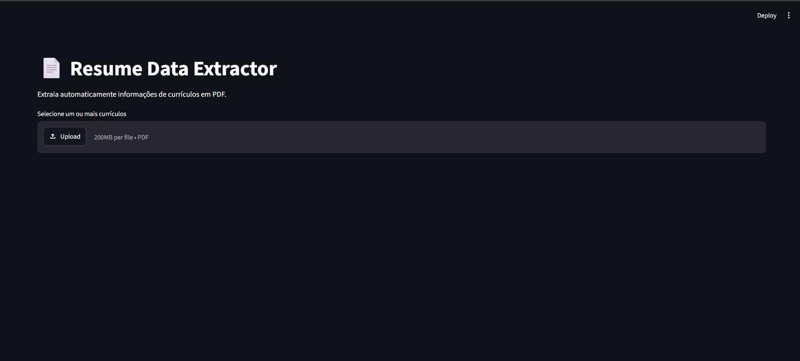
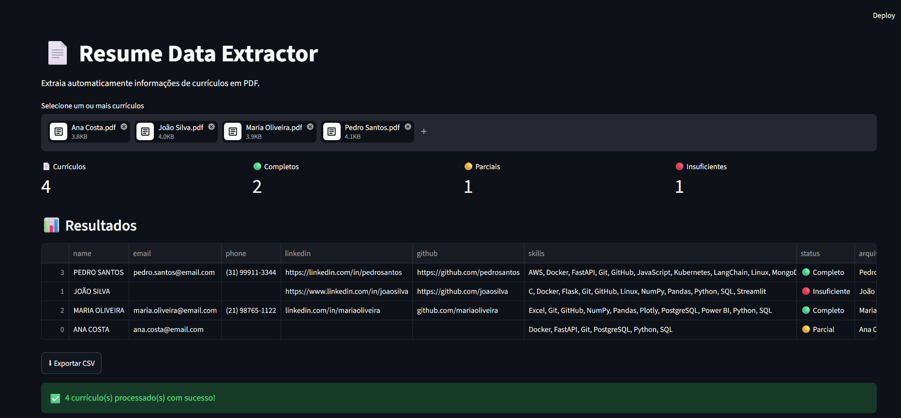
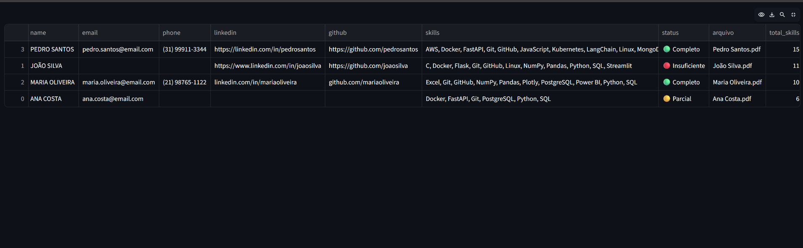
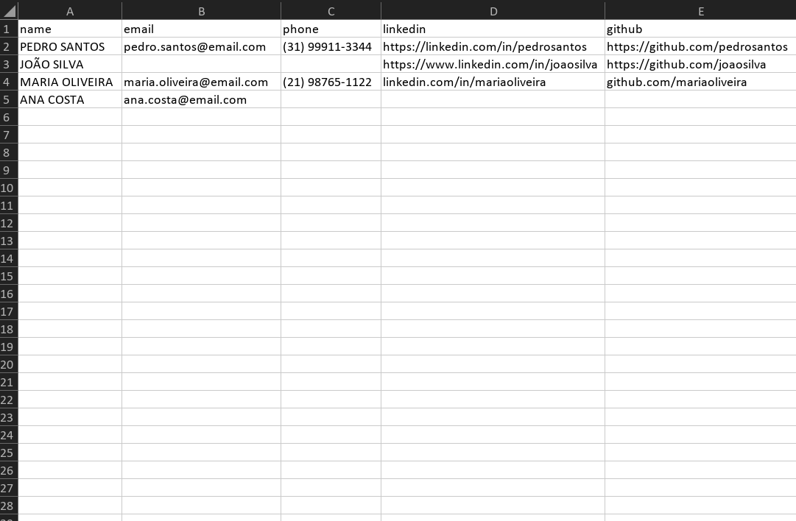
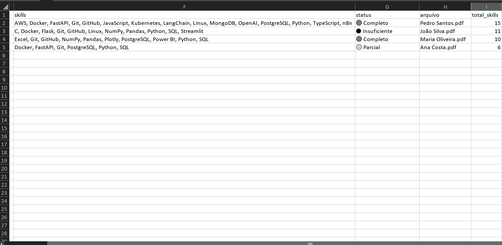

# 📄 Resume Parser

Sistema desenvolvido em Python para automatizar a extração de informações estruturadas de currículos em PDF.

---

# 📌 Visão Geral

O **Resume Parser** é uma aplicação desenvolvida em Python que automatiza a leitura de currículos em PDF, extraindo informações importantes como nome, e-mail, telefone, LinkedIn, GitHub e habilidades técnicas.

Após a análise, os dados são organizados em uma tabela interativa e podem ser exportados para CSV, tornando o processo de triagem de currículos mais rápido e eficiente.

Este projeto foi desenvolvido com o objetivo de demonstrar boas práticas de desenvolvimento em Python, organização de código e processamento de documentos.

---

# 🚀 Funcionalidades

- 📄 Leitura de múltiplos currículos em PDF
- 👤 Extração automática do nome
- 📧 Extração de e-mail
- 📱 Extração de telefone
- 💼 Identificação do LinkedIn
- 🐙 Identificação do GitHub
- 🛠️ Detecção automática de Hard Skills
- 📊 Exibição dos resultados em uma tabela interativa
- 📈 Contagem automática de habilidades por currículo
- ✅ Classificação dos currículos (Completo, Parcial ou Insuficiente)
- 📥 Exportação dos resultados para CSV

---

# 🎥 Demonstração


---

# 🖼️ Interface

## Tela inicial



---

## Resultado da análise




---

## Download do .csv




---

# 📂 Estrutura do Projeto

```text
Resume-Parser/
│
├── assets/
│   ├── gifs/
│   │   └── demo.gif
│   │
│   └── images/
│       ├── arqui1.png
│       ├── arqui2.png
│       ├── tela1.png
│       ├── telaresu.png
│       └── telaresu2.png
│
├── output/
│
├── sample_pdfs/
│   ├── ana_costa.pdf
│   ├── joao_silva.pdf
│   ├── maria_oliveira.pdf
│   └── pedro_santos.pdf
│
├── src/
│   ├── exporter.py
│   ├── extractor.py
│   ├── parser.py
│   └── skills.py
│
├── .gitignore
├── app.py
├── README.md
└── requirements.txt
```

---

# ⚙️ Tecnologias Utilizadas

- Python
- Streamlit
- Pandas
- PyPDF2
- Expressões Regulares (Regex)

---

# 🔄 Fluxo da Aplicação

```text
Upload dos currículos
        │
        ▼
Leitura dos PDFs
        │
        ▼
Extração de:
• Nome
• E-mail
• Telefone
• LinkedIn
• GitHub
• Hard Skills
        │
        ▼
Criação do DataFrame
        │
        ▼
Classificação dos currículos
        │
        ▼
Visualização dos resultados
        │
        ▼
Exportação para CSV
```

---

# 📊 Exemplo de Resultado

Após o processamento dos currículos, a aplicação organiza automaticamente todas as informações extraídas em uma tabela interativa.

| Arquivo | Nome | Email | Telefone | Total Skills | Status |
|----------|------|--------|-----------|--------------:|---------|
| Pedro Santos.pdf | PEDRO SANTOS | pedro.santos@email.com | (31) 99911-3344 | 15 | 🟢 Completo |
| João Silva.pdf | JOÃO SILVA | joao.silva@email.com | — | 10 | 🔴 Insuficiente |
| Maria Oliveira.pdf | MARIA OLIVEIRA | maria.oliveira@email.com | (21) 98765-1122 | 9 | 🟢 Completo |
| Ana Costa.pdf | ANA COSTA | ana.costa@email.com | — | 6 | 🟡 Parcial |

 Além da visualização em tabela, todos os dados podem ser exportados automaticamente para um arquivo CSV.
 Após a análise dos currículos, o sistema organiza automaticamente todas as informações em uma tabela interativa, calcula a quantidade de habilidades encontradas, classifica o status de cada currículo e permite exportar os resultados para CSV.

# 🧠 Competências Demonstradas

Durante o desenvolvimento deste projeto foram aplicados conhecimentos em:

- Programação Orientada a Objetos (POO)
- Manipulação de arquivos PDF
- Processamento de texto
- Expressões Regulares (Regex)
- Estruturação de projetos Python
- Manipulação de DataFrames com Pandas
- Desenvolvimento de interfaces com Streamlit
- Exportação de dados para CSV
- Organização modular de código
- Tratamento de dados ausentes

---

# 💻 Como Executar

Clone o repositório:

```bash
git clone https://github.com/DaviSantos-23/Resume-Parser.git
```

Entre na pasta do projeto:

```bash
cd Resume-Parser
```

Instale as dependências:

```bash
pip install -r requirements.txt
```

Execute a aplicação:

```bash
streamlit run app.py
```

---

# 📁 Currículos de Exemplo

O projeto contém quatro currículos fictícios na pasta **sample_pdfs/** para facilitar os testes da aplicação.

- João Silva
- Maria Oliveira
- Pedro Santos
- Ana Costa (currículo incompleto)

Esses arquivos permitem testar rapidamente todas as funcionalidades implementadas.

---

# 🔮 Melhorias Futuras

- Suporte para arquivos DOCX
- Exportação para Excel
- Exportação para JSON
- OCR para PDFs digitalizados
- Dashboard com estatísticas
- Classificação automática de habilidades
- Sistema de pontuação de currículos utilizando IA

---

# 👨‍💻 Autor

**Davi Santos**

Estudante de Ciência da Computação

**Tecnologias de Interesse**

- Python
- Inteligência Artificial
- Ciência de Dados
- Automação
- n8n
- SQL

GitHub:

https://github.com/DaviSantos-23

---

# 📄 Licença

Este projeto está licenciado sob a licença MIT.